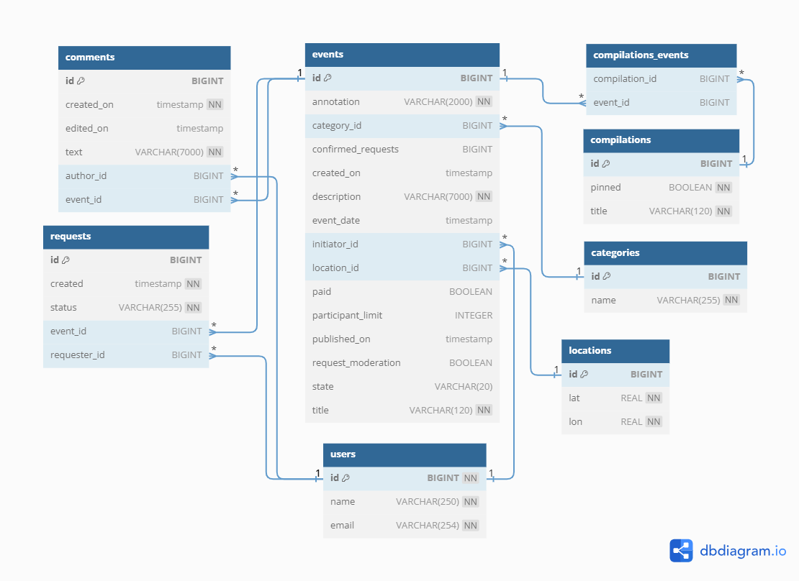

# java-explore-with-me

### Описание
Двухмодульное приложение на основе микросервисной архитектуры для размещения и поиска событий.
Функционал различается в зависимости от уровня доступа — публичный, авторизованный пользователь или администратор.

Приложение состоит из основного сервиса, основной базы данных, 
сервиса статистики просмотров и базы данных для статистики.
Каждая часть запускается в отдельном docker-контейнере.

[Ссылка на финальный PR](https://github.com/dima-irqtsk/java-explore-with-me/pull/5)

### Стек:
- Java 11
- Spring Boot
- Hibernate
- PostgreSQL
- Maven
- Lombok
- MapStruct
- Postman
- Docker

## Endpoints
- [ТЗ для API основного сервиса](./ewm-main-service-spec.json)
- [ТЗ для API сервиса статистики](./ewm-stats-service-spec.json)
- В качестве дополнительной функциональности реализована возможность комментирования событий.

### Comments
- `[GET] /admin/comments?from={from}&size={size}` — получение списка всех комментариев с пагинацией
- `[DELETE] /admin/comments/{commentId}` — удаление комментария
- `[POST] /users/{userId}/comments?eventId={eventId}` — создание нового комментария к событию
- `[PATCH] /users/{userId}/comments/{commentId}` — редактирование своего комментария
- `[DELETE] /users/{userId}/comments/{commentId}` — удаление своего комментария
- `[GET] /users/{userId}/comments?eventId={eventId}&from={from}&size={size}` — получение списка всех комментариев
  пользователя `userId` к событию `eventId` с пагинацией
- `[GET] /users/{userId}/comments?from={from}&size={size}` — получение списка всех комментариев пользователя `userId`
  с пагинацией
- `[GET] /comments?eventId={eventId}&from={from}&size={size}` — получение списка всех комментариев к событию `eventId`
  с пагинацией
- `[GET] /comments/{commentId}` — получение отдельного комментария по айди

## Схема базы данных основного сервиса

- [Ссылка на диаграмму в редакторе](https://dbdiagram.io/d/64e5b4fb02bd1c4a5e3fb9a5)